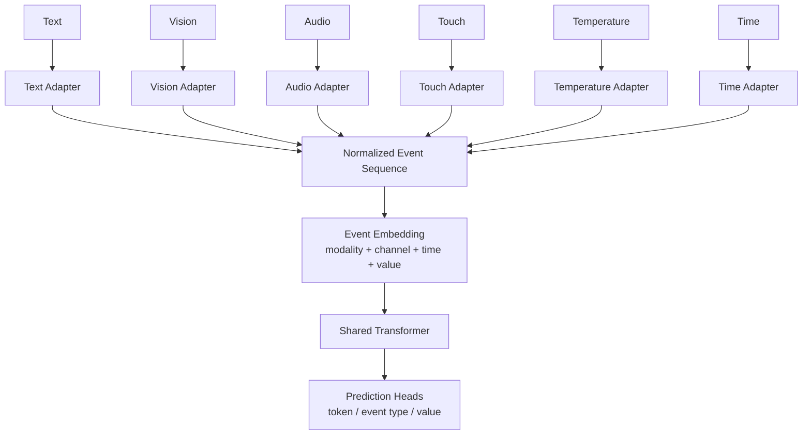
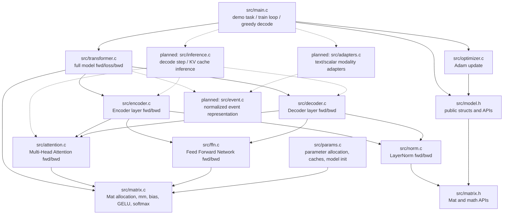
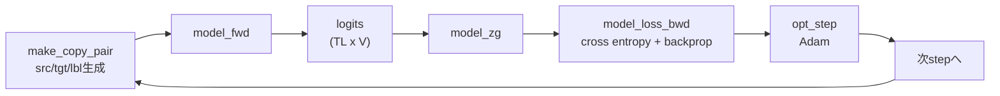
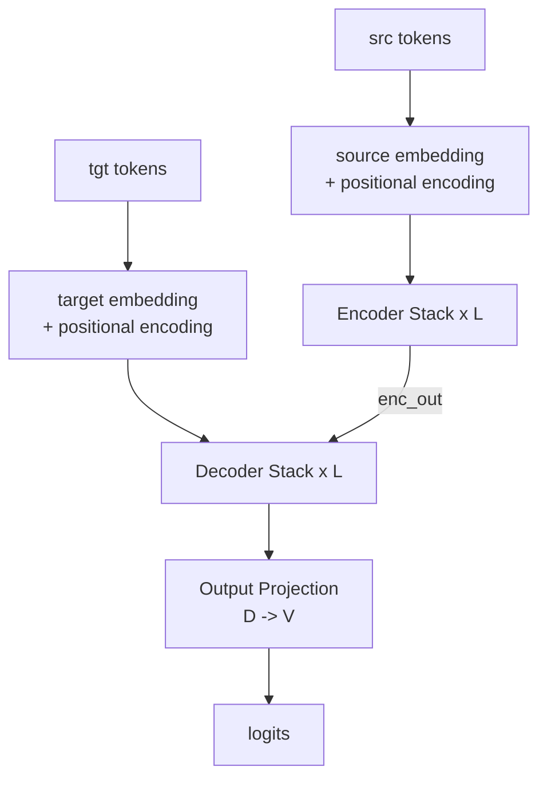
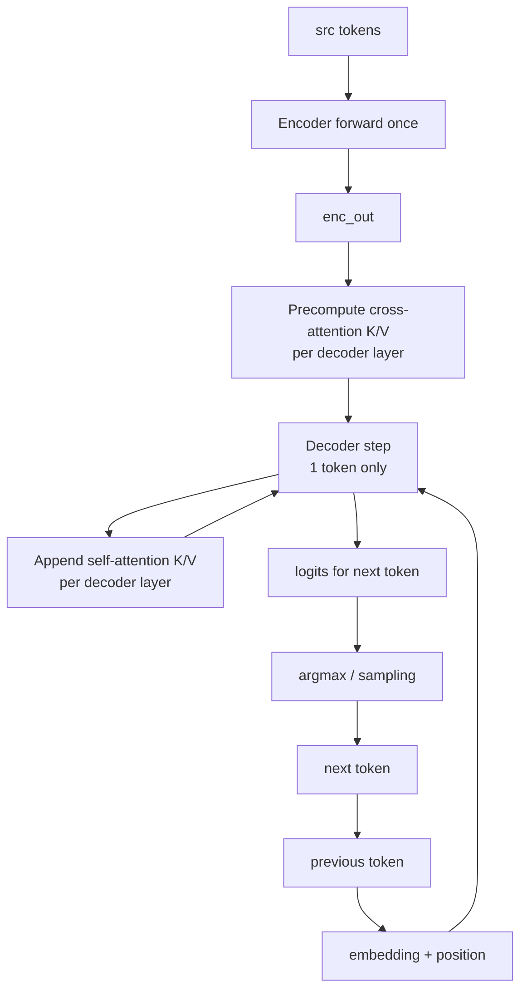

# MyLLM 計画・仕様書・アーキテクチャ

最終更新: 2026-05-30（実行確認済み）

## 1. 現在の目的

MyLLMは、C言語のみでTransformerの主要構成を実装し、最小のseq2seq学習タスクで動作確認するためのプロジェクトである。

現在のデモタスクは「sequence copy」で、入力系列をそのまま出力系列として学習する。

- 入力例: `[BOS, a, b, c, EOS]`
- Decoder入力: `[BOS, a, b, c]`
- 教師ラベル: `[a, b, c, EOS]`
- Token定義:
  - `0 = PAD`
  - `1 = BOS`
  - `2 = EOS`
  - `3..10 = alphabet token`

## 2. 現在の計画

### Phase 1: 開発環境の整備

- [x] Windows環境へMSYS2を導入する。
- [x] `gcc` と `mingw32-make` をPowerShell/VSCodeから利用可能にする。
- [x] 既存Makefileでビルド可能な状態にする。
- [x] `make clean` がWindows PowerShellでも動くように調整する。（2026-05-30: `del /Q` に変更済み）

### Phase 2: 現状実装の安定化

- [x] `transformer.exe` 実行時に終了コード `1` で終了する原因を調査する。（2026-05-30確認: exit code 0で正常終了。5000 step学習が収束し greedy decodeも正確。）
- [x] コンパイル警告を解消する。（2026-05-30: 警告ゼロ確認済み）
  - `src/attention.c`: 未使用変数 `Wo` → 削除
  - `src/ffn.c`: 未使用変数 `S` → `ffn_fwd` から削除
  - `src/transformer.c`: 未使用引数 `enc_out` → `(void)enc_out` で抑制
- [x] `model_new`, cache生成、forward/backwardのメモリ管理を点検する。（2026-05-30: `ac_new` メモリリーク修正 — `ac_init` ヘルパーに分離し `ec_new`/`dc_new` 内でヒープリークを解消）
- [x] 学習ループが5000 stepまで安定して回ることを確認する。（2026-05-30確認: lossが収束し greedy decodeも正確。）

### Phase 3: 正しさの検証

- [x] 行列演算、GELU、softmax、LayerNormの単体テストを追加する。（2026-05-30: `src/test.c` を追加、`mingw32-make test` で 25/25 pass）
- [x] Attention、FFN、Encoder/Decoder Layerのshape検証を追加する。（2026-05-30: test.c に attn/ffn/el/dl shape tests + attn_bwd 有限差分を追加、42/42 pass）
- [x] 小さな構成で勾配チェックを行う。（2026-05-30: `ln_bwd` の有限差分チェックでバグ発見・修正済み。正しいバックワードは `sum(gamma*dy)` を使う必要があった）
- [x] sequence copy taskでlossが低下することを確認する。（2026-05-30: 5000 step で loss ≈ 0 に収束確認済み）

### Phase 4: 使いやすさの改善

- [ ] 実行パラメータをコマンドライン引数または設定ファイルから変更できるようにする。
- [ ] 学習ログを見やすくする。
- [ ] 推論サンプルを分離する。
- [ ] 将来的に学習データ読み込み、モデル保存、モデル読み込みを追加する。

### Phase 5: KV cacheによる推論高速化

- [x] 学習用cacheと推論用KV cacheを分離する。（2026-05-30: `src/inference.c` に `DecodeCache` を実装）
- [x] Decoder self-attentionで、過去tokenのKey/Valueを保持する構造体を追加する。（`KV`, `DLayerKV`, `DecodeCache`）
- [x] Greedy decode時に、毎stepでtarget prefix全体を再計算する方式から、新規tokenだけを処理する方式へ移行する。（`model_decode_step` 実装）
- [x] Cross-attention用に、encoder出力から作るKey/Valueを事前計算して再利用する。（`decode_cache_precompute_cross` 実装）
- [x] KV cacheあり/なしの推論結果が一致することを確認する。（main.c で照合: "KV cache match: OK" 確認済み）
- [x] token数ごとの推論時間を測定し、再計算方式との差を記録する。（2026-05-30: N=200 benchmark: baseline 1.155ms vs KV cache 0.310ms → **3.73x 高速化**）

### Phase 6: モダリティ非依存の標準入力表現

- [x] 文章tokenだけに依存しない、共通の入力単位 `EventToken` を設計する。（2026-05-30: `src/event.h` に `Modality` enum と `EventSeq` を定義）
- [x] 視覚、聴覚、触覚、温度、時間などを、同じ形式の正規化済みtoken列へ変換するadapter層を追加する。（`event_append_text`, `event_append_scalar` を実装）
- [x] 各tokenに `modality`, `channel`, `time`, `value`, `token_id` などのメタ情報を持たせる。
- [x] 連続値は正規化、量子化、または小さな埋め込みベクトルへ射影して、Transformerの `D` 次元へ揃える。（2026-05-30: `EventEmbed` に `val_w`/`val_b` で scalar → D 次元射影を実装）
- [x] モデル本体は入力元の種類を直接知らず、標準表現だけを学習する構造にする。（2026-05-30: `src/event_task.c` に EventEmbed + Encoder の end-to-end 学習ループを実装。Encoder は modality を知らず EventEmbed 出力のみを受け取る。loss 1.93→0.23 に低下確認）
- [x] まずは数値センサー風データとtext tokenを同じ列へ混ぜる小さなデモを作る。（2026-05-30: main.c で TEXT/TEMP/TIME 混合の EventSeq → 8×64 埋め込み行列を実演）

## 3. ビルド仕様

### 使用コンパイラ

- GCC: MSYS2 UCRT64版
- Make: `mingw32-make`

### 現在のビルドコマンド

```powershell
mingw32-make
```

### 現在の出力

```text
transformer.exe
```

### Makefile概要

- `CC = gcc`
- `CFLAGS = -O2 -Wall -Wextra -std=c99 -Isrc`
- `LDFLAGS = -lm`
- 対象ソース:
  - `src/matrix.c`
  - `src/params.c`
  - `src/norm.c`
  - `src/attention.c`
  - `src/ffn.c`
  - `src/encoder.c`
  - `src/decoder.c`
  - `src/transformer.c`
  - `src/optimizer.c`
  - `src/main.c`

### 既知のビルド課題

`mingw32-make clean` は、現在のPowerShell実行では `rm` が見つからず失敗する。

対応案:

```make
clean:
	del /Q $(TARGET).exe 2>NUL
	del /Q $(TARGET) 2>NUL
```

または、MSYS2 shellから `make clean` を実行する運用に寄せる。

## 4. モデル仕様

### Config

`Cfg` はモデル全体のハイパーパラメータを保持する。

| フィールド | 意味 |
|---|---|
| `V` | vocabulary size |
| `T` | max sequence length |
| `D` | model dimension |
| `H` | attention head数 |
| `F` | FFN hidden dimension |
| `L` | encoder/decoder layer数 |
| `eps` | LayerNorm epsilon |

現在のデモ設定:

```c
Cfg cfg = {
    .V   = 11,
    .T   = 12,
    .D   = 64,
    .H   = 4,
    .F   = 256,
    .L   = 2,
    .eps = 1e-5f
};
```

### パラメータ構造

`P` は学習可能パラメータを表す。

| フィールド | 意味 |
|---|---|
| `w` | weight本体 |
| `g` | gradient |
| `m` | Adam first moment |
| `v` | Adam second moment |
| `n` | 要素数 |

### Model構造

`Model` はTransformer全体を保持する。

| フィールド | 意味 |
|---|---|
| `se` | source embedding |
| `te` | target embedding |
| `pos` | sinusoidal positional encoding |
| `enc` | encoder layer配列 |
| `dec` | decoder layer配列 |
| `proj` | decoder outputからvocab logitsへの射影 |
| `proj_b` | output projection bias |

## 5. レイヤ仕様

### Multi-Head Attention

実装ファイル: `src/attention.c`

Forward:

1. `Q = x @ Wq + bq`
2. `K = kv @ Wk + bk`
3. `V = kv @ Wv + bv`
4. headごとに `scores = Q_h @ K_h^T / sqrt(dk)`
5. Decoder self-attentionの場合はcausal maskを適用する。
6. `attn = softmax(scores)`
7. `head_out = attn @ V_h`
8. head出力を結合し、`out = concat @ Wo + bo`

Backward:

- `Wo`, `Wq`, `Wk`, `Wv` と各biasの勾配を蓄積する。
- self-attentionではquery側とkey/value側の勾配が同じ入力へ戻る。
- cross-attentionではquery側はdecoder、key/value側はencoder出力へ戻る。

### Feed-Forward Network

実装ファイル: `src/ffn.c`

Forward:

1. `h = x @ W1 + b1`
2. `h = GELU(h)`
3. `out = h @ W2 + b2`

Backward:

- GELU前の値はforwardで保持せず、backward内で再計算する。
- `W1`, `b1`, `W2`, `b2` の勾配を蓄積する。

### LayerNorm

実装ファイル: `src/norm.c`

Forward:

```text
y = gamma * ((x - mean) / sqrt(var + eps)) + beta
```

Backward:

- `gamma`, `beta` の勾配を蓄積する。
- 入力 `x` への勾配を加算する。

### Encoder Layer

実装ファイル: `src/encoder.c`

現在の実装はコメント上ではPost-LN寄りの流れである。

```text
sa_out = self_attn(xi, xi)
r1     = xi + sa_out
x1     = LN1(r1)
ff_out = FFN(x1)
r2     = r1 + ff_out
xo     = LN2(r2)
```

### Decoder Layer

実装ファイル: `src/decoder.c`

```text
sa_out = masked_self_attn(xi, xi)
x1     = LN1(xi + sa_out)
ca_out = cross_attn(x1, enc_out)
x2     = LN2(x1 + ca_out)
ff_out = FFN(x2)
xo     = LN3(x2 + ff_out)
```

## 6. Full Model Forward仕様

実装ファイル: `src/transformer.c`

```text
src token ids
  -> source embedding + positional encoding
  -> encoder layers
  -> enc_out

tgt token ids
  -> target embedding + positional encoding
  -> decoder layers with enc_out
  -> dec_out
  -> output projection
  -> logits
```

## 7. Loss / Backward仕様

`model_loss_bwd` は以下を行う。

1. `logits` からsoftmax cross entropy lossを計算する。
2. `d_logits` を作る。
3. output projectionの勾配を計算する。
4. decoder layerを逆順にbackwardする。
5. target embeddingの勾配を蓄積する。
6. encoder layerを逆順にbackwardする。
7. source embeddingの勾配を蓄積する。
8. 平均lossを返す。

## 8. Optimizer仕様

実装ファイル: `src/optimizer.c`

Adamを使用する。

```text
m = b1 * m + (1 - b1) * grad
v = b2 * v + (1 - b2) * grad^2
w = w - lr_t * m / (sqrt(v) + eps)
```

現在の設定:

```c
Opt opt = {
    .lr = 1e-3f,
    .b1 = 0.9f,
    .b2 = 0.98f,
    .eps = 1e-9f,
    .step = 0
};
```

## 9. KV cache推論仕様

### 目的

現在のgreedy decodeは、1 token生成するたびにdecoder入力全体を再度 `model_fwd` に渡している。

```text
step 1: [BOS]
step 2: [BOS, y1]
step 3: [BOS, y1, y2]
...
```

この方式は実装が単純だが、過去tokenの計算を毎回やり直すため、系列が長くなるほど非効率になる。

KV cacheでは、各decoder layerのAttentionで計算済みのKey/Valueを保持し、新しく追加されたtoken分だけを計算する。

### 保持するもの

保持するのはモデルの重みではなく、入力ごとに計算された一時状態である。

| 対象 | 保持内容 | 用途 |
|---|---|---|
| Decoder self-attention | 過去target tokenのK/V | 新tokenのQから過去全体へattentionする |
| Decoder cross-attention | encoder出力由来のK/V | 生成stepごとの再計算を避ける |
| Layerごとの中間出力 | 直前tokenのhidden state | 次layerへ渡す |

学習可能パラメータ `Wq`, `Wk`, `Wv`, `Wo` は更新されない。推論中に増えていくのは、各layerのK/V cacheである。

### 推論時の流れ

初期化:

1. source sequenceをencoderへ通して `enc_out` を得る。
2. decoder各layerのcross-attention用K/Vを `enc_out` から事前計算する。
3. decoder self-attention用KV cacheを空で初期化する。

各生成step:

1. 直前に生成された1 tokenだけをembedding + positional encodingする。
2. 各decoder layerで新tokenの `Q,K,V` を計算する。
3. 新tokenの `K,V` をself-attention cacheへ追加する。
4. 新tokenの `Q` と、cache済みの全 `K` でattention scoreを計算する。
5. cache済みの全 `V` からattention出力を得る。
6. cross-attentionでは事前計算済みencoder K/Vを使う。
7. 最終layer出力からlogitsを作り、次tokenを選ぶ。

### 追加予定API

候補:

```c
typedef struct {
    Mat K;
    Mat V;
    int len;
} KV;

typedef struct {
    KV self;
    KV cross;
} DLayerKV;

typedef struct {
    DLayerKV *layers;
    int max_len;
    int L;
} DecodeCache;

DecodeCache *decode_cache_new(const Cfg *cfg);
void decode_cache_del(DecodeCache *c);
void decode_cache_reset(DecodeCache *c);

void model_encode(Model *m, const int *src, int SL, EC **ec, Mat *enc_out);
void model_decode_step(Model *m,
                       int token, int pos,
                       const Mat *enc_out,
                       DecodeCache *kv,
                       Mat *logits_1xV);
```

実装時には、学習用の `AC` / `EC` / `DC` と混ぜすぎないことを優先する。backward用cacheは全tokenの中間値を保持する必要があり、推論用KV cacheとは寿命も目的も異なるためである。

### 期待する効果

KV cacheなし:

```text
生成stepごとに target prefix 全体を再forwardする
```

KV cacheあり:

```text
生成stepごとに新しい1 tokenだけをdecoderに通す
```

短いsequence copy taskでは差は小さいが、長い文脈や将来の会話生成では重要になる。

## 10. モダリティ非依存入力仕様

### 目的

このプロジェクトでは、モデルを特定の情報形式に縛らない方向へ拡張する。

文章、画像、音、触覚、温度、時間などを、それぞれ専用形式のままモデルへ直接渡すのではなく、いったん共通の標準表現へ落とし込む。

```text
raw input
  -> modality adapter
  -> normalized event tokens
  -> shared embedding / projection
  -> Transformer
```

モデル本体は「これは画像である」「これは音である」といった生データ形式を直接扱わない。扱うのは、adapter層で整形された共通token列である。

### 標準入力単位

候補となる共通表現:

```c
typedef enum {
    MOD_TEXT,
    MOD_IMAGE,
    MOD_AUDIO,
    MOD_TOUCH,
    MOD_TEMPERATURE,
    MOD_TIME,
    MOD_GENERIC_SCALAR
} Modality;

typedef struct {
    int modality;
    int channel;
    int time_index;
    float value;
    float confidence;
} EventToken;
```

この構造体は、最初の設計案である。実装時には、Cで扱いやすいように配列化する。

```c
typedef struct {
    int *modality;
    int *channel;
    int *time_index;
    float *value;
    float *confidence;
    int n;
} EventSeq;
```

### 正規化方針

| 入力種別 | 標準化の例 |
|---|---|
| Text | token idを `MOD_TEXT` のeventとして扱う |
| Image | pixel/patch/edge/featureをevent列へ変換する |
| Audio | waveform frameまたはspectrogram binをevent列へ変換する |
| Touch | 圧力、接触位置、接触時間をevent列へ変換する |
| Temperature | センサー値を正規化してevent列へ変換する |
| Time | 絶対時刻、経過時間、周期特徴をevent列へ変換する |

連続値は、そのままfloatで扱う案と、binへ量子化してtoken id化する案の両方を検討する。

最初の実装では、複雑な画像/音声を直接扱う前に、以下のような簡単な混合入力を扱う。

```text
[TEXT: BOS]
[TEMP: 0.42]
[TIME: 0.15]
[TEXT: token_7]
[TOUCH: pressure_0.81]
```

### Embedding設計

EventTokenをTransformerの `D` 次元へ変換するために、複数の埋め込みを合成する。

```text
event_embedding =
    modality_embedding
  + channel_embedding
  + time_embedding
  + value_projection
  + confidence_projection
```

現在の `se` / `te` はtext token id前提なので、将来的には以下のように分離する。

```text
旧:
token id -> embedding

新:
EventToken -> event embedding
```

### 学習目標

当面の学習目標は、次event予測である。

```text
過去のevent列を読む
↓
次に来るeventの種類・値・tokenを予測する
```

文章の場合は従来の次token予測に近い。温度や触覚などの連続値の場合は、分類または回帰として扱う。

初期段階では実装を簡単にするため、連続値をbin化し、すべてを離散token予測に寄せる。

### 設計原則

- モデル本体は、可能な限り入力元の種類に依存しない。
- modality固有処理はadapter層に閉じ込める。
- Transformerへ入る時点では、すべて同じ `D` 次元のtoken列にする。
- 時間情報は全モダリティで重要なため、position encodingとは別にevent timeも扱えるようにする。
- 最初から巨大なマルチモーダル処理を狙わず、text + scalar sensorの小さな実験から始める。

## 11. Mermaid: モダリティ標準化アーキテクチャ



## 12. Mermaid: モジュール構成図



## 13. Mermaid: 学習データフロー



## 14. Mermaid: Transformer内部データフロー



## 15. Mermaid: KV cache推論データフロー



## 16. Mermaid: Encoder / Decoder Layer詳細

```mermaid
flowchart TB
    subgraph EncoderLayer["Encoder Layer"]
        EX["xi"]
        ESA["Self Attention"]
        ER1["Residual Add"]
        ELN1["LayerNorm 1"]
        EFFN["FFN"]
        ER2["Residual Add"]
        ELN2["LayerNorm 2"]
        EX --> ESA --> ER1
        EX --> ER1
        ER1 --> ELN1 --> EFFN --> ER2
        ER1 --> ER2
        ER2 --> ELN2
    end

    subgraph DecoderLayer["Decoder Layer"]
        DX["xi"]
        DSA["Masked Self Attention"]
        DR1["Residual Add"]
        DLN1["LayerNorm 1"]
        DCA["Cross Attention"]
        DR2["Residual Add"]
        DLN2["LayerNorm 2"]
        DFFN["FFN"]
        DR3["Residual Add"]
        DLN3["LayerNorm 3"]
        ENC["enc_out"]

        DX --> DSA --> DR1
        DX --> DR1
        DR1 --> DLN1 --> DCA
        ENC --> DCA
        DCA --> DR2
        DLN1 --> DR2
        DR2 --> DLN2 --> DFFN --> DR3
        DLN2 --> DR3
        DR3 --> DLN3
    end
```



## 17. 現時点の既知の注意点

- `transformer.exe` のアクセス違反は修正済み。原因はbackwardでcache確保時の最大長 `T` を実系列長として扱っていたこと。
- `main.c` は5000 step学習するため、正常動作時は一定時間実行される想定である。
- ソース内コメントの一部が文字化けしている。元の文字コードと現在の表示/保存形式を確認したうえでUTF-8へ統一したい。
- `ec_new` / `dc_new` は `ac_new` の戻り値を値コピーしており、元ポインタ自体は解放されない。この設計はメモリリークの可能性があるため見直し対象。
- FFN backwardはpre-activationを再計算する実装で、シンプルだが計算量は増える。
- 現在はbatch次元を持たず、1サンプルずつ学習する。
- 現在のgreedy decodeはKV cache未使用で、生成stepごとにtarget prefix全体を再計算している。
- 現在のembeddingはtext token id前提であり、モダリティ非依存のEventToken入力には未対応。

## 18. 次に着手する候補

優先順位の高い順:

1. ~~実行時終了コード `1` の原因調査~~ → 解決済み
2. ~~`EventToken` / `EventSeq` 設計をコードへ追加する~~ → 解決済み
3. ~~Text Adapterの追加~~ → `src/adapters.c` の `TextAdapter` で解決済み
4. ~~Scalar Adapterの追加~~ → `src/adapters.c` の `ScalarBinAdapter` で解決済み
5. ~~EventSeqから `D` 次元embeddingを作るevent embedding層を試作する~~ → `EventEmbed` で解決済み
6. ~~KV cacheなし/ありのgreedy decode仕様を分離する~~ → `src/inference.c` で解決済み
7. ~~Decoder self-attention用KV cache構造体を追加する~~ → 解決済み
8. ~~Cross-attention用encoder K/Vの事前計算を追加する~~ → 解決済み
9. ~~KV cache版decodeと既存decodeの出力一致テストを追加する~~ → "KV cache match: OK" 確認済み
10. ~~`clean` ターゲットのWindows対応~~ → 解決済み
11. ~~コンパイル警告の解消~~ → 解決済み
12. ~~`ac_new` 周辺のメモリ管理見直し~~ → 解決済み
13. ~~小さな単体テスト追加~~ → `src/test.c`、42/42 pass
14. ~~学習ログ整備・推論サンプル分離~~ → 解決済み

### 次の候補（新規）

1. `EventSeq` の capacity safety → 解決済み（2026-05-30）
2. `EventHead` 出力側の実装 → 解決済み（2026-05-30）
3. `src/adapters.h/c` の Adapter interface → 解決済み（2026-05-30）
4. event_task.c のフル pipeline 統合 → 解決済み（2026-05-30）
5. seq2seq タスクでの EventEmbed+EventHead 統合（Decoder 側も EventHead 経由）
6. EventHead の出力から EventSeq への変換関数
7. 複数モダリティ混在デモ（TEXT + TEMP + TIME）
8. モデル保存・読み込み
