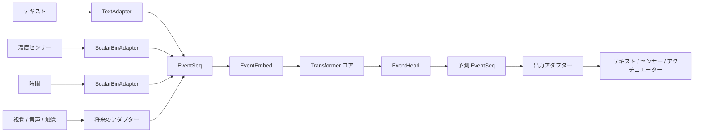

# MyLLM

C言語のみで実装した小規模Transformerプロジェクト。

テキスト・温度センサー・時間など複数のモダリティを共通の `EventSeq` 形式に変換してからモデルへ渡す「モダリティ非依存アーキテクチャ」を設計・実験するためのプレイグラウンドです。

## 目標

- C言語のみでTransformerを最小実装する
- 外部フレームワークなしで学習・推論を完結させる
- KV cacheによる効率的な自己回帰推論を実現する
- 異なる入力源を共通Eventフォーマットで統一的に扱う
- 学習済み重みをファイルに保存・読み込みできるようにする
- 読んで理解・拡張できる実装を維持する

## 現在の機能

- Encoder-Decoder Transformer コア
- Self-Attention、Cross-Attention、FFN、LayerNorm、GELU、Adam最適化
- Greedy デコード
- Decoder KV cache による高速自己回帰推論（ベースラインの約3〜4倍高速）
- `EventSeq` 標準化Eventシーケンス
- `EventEmbed` EventからTransformer次元への埋め込み変換（forward/backward）
- `EventHead` 隠れ状態からEvent語彙ロジットへの射影
- テキストおよびスカラービンアダプター（`TextAdapter` / `ScalarBinAdapter`）
- モデル重みのバイナリ保存・読み込み（`model_save` / `model_load`）
- `EventEmbed` / `EventHead` の保存・読み込み
- コア数学・Attention・因果マスク・アダプター・シリアライゼーションの単体テスト
- TEXT → TEMP → TIME の決定論的イベントサイクルのエンドツーエンドデモ

## アーキテクチャ



## ファイル構成

```text
MyLLM/
├── Makefile
├── README.md
├── Note/
│   └── MyLLM_plan_spec_architecture.md   設計仕様書・計画書
└── src/
    ├── main.c          デモエントリーポイント
    ├── model.h         モデル型と公開APIの定義
    ├── matrix.c/h      行列演算ユーティリティ
    ├── params.c        パラメータ確保・初期化・キャッシュ管理
    ├── norm.c          LayerNorm forward/backward
    ├── attention.c     Multi-Head Attention forward/backward
    ├── ffn.c           Feed-Forward Network forward/backward
    ├── encoder.c       Encoder層 forward/backward（causal引数あり）
    ├── decoder.c       Decoder層 forward/backward
    ├── transformer.c   フルモデル forward/loss/backward
    ├── optimizer.c     Adam最適化
    ├── inference.c     KV cache推論（model_encode / model_decode_step）
    ├── serialize.c     モデル重みのバイナリ保存・読み込み
    ├── event.c/h       EventSeq・EventEmbed・EventHead の実装
    ├── adapters.c/h    TextAdapter・ScalarBinAdapter・event_head_to_seq
    ├── event_task.c    マルチモーダルEventタスクのデモ・学習ループ
    └── test.c          単体テスト（75ケース）
```

## 動作環境

- GCC（C99対応）
- `mingw32-make`（Windows）または `make`（Linux/macOS）
- 数学ライブラリ（`-lm`）

## ビルド

```sh
mingw32-make
```

生成物:

```text
transformer.exe   （Windowsの場合）
transformer       （その他）
```

## 実行

```sh
./transformer
```

実行されるデモ:

1. **Sequence copy 学習タスク**（D=64, H=4, F=256, L=2, 5000 step）
2. **Greedy デコード（ベースライン）** — prefix全体を毎ステップ再フォワード
3. **Greedy デコード（KV cache）** — 1トークンずつ逐次デコード
4. **KV cache 一致確認** — 両方式の出力が一致することを検証
5. **推論時間計測** — N=200シーケンスでのベースライン vs KV cache 比較
6. **EventEmbed デモ** — TEXT/TEMP/TIME 混在の EventSeq を 8×64 埋め込みに変換
7. **EventEmbed 学習デモ** — 決定論的3モダリティサイクルの学習とルール精度検証

実行例（抜粋）:

```text
Training sequence copy task  (D=64 H=4 F=256 L=2)
step      loss      smooth    min       elapsed
-------- -------- -------- -------- --------
  5000    0.0000    0.0000    0.0000    0.67s
Total training time: 6.54 s

KV cache match: OK
KV cache : 0.310 ms/seq   Speedup : 3.72x

=== EventEmbed end-to-end demo (3 modalities) ===
Rule accuracy: 24/24 = 100.0%  PASS
```

## テスト

```sh
mingw32-make test
```

現在 **75ケース** をカバー:

| カテゴリ | 内容 |
|---|---|
| 行列演算 | mm、mm_at_add の数値検証 |
| GELU | forward 値・backward 有限差分 |
| Softmax | 行和=1・単調性 |
| LayerNorm | forward 正規化・backward 有限差分 |
| Attention | shape 検証・因果マスク・backward 有限差分 |
| causal テスト | `causal=1` で未来トークンを見ないことを確認 |
| EventEmbed | forward 境界検証・validation エラー検出 |
| アダプター | ScalarBinAdapter n_bins guard、event_head_to_seq |
| シリアライゼーション | model・EventEmbed・EventHead の保存/読み込みラウンドトリップ |

## クリーン

```sh
mingw32-make clean
```

## Event 設計方針

このプロジェクトの中心的な設計方針は、**モデル本体が生のモダリティ形式に直接依存しない**ことです。

各入力源はデータを `EventSeq` 形式に変換してからモデルへ渡します。

```text
センサー/入力装置
  -> modality adapter
  -> 標準化 EventSeq
  -> EventEmbed
  -> Transformer コア
  -> EventHead
  -> 標準化 EventSeq
  -> output adapter
  -> 出力装置
```

### Event語彙の構成

現在のデモでは以下のレイアウトを使用しています（重複なし）:

| 範囲 | モダリティ | 説明 |
|---|---|---|
| `0 〜 10` | `MOD_TEXT` | テキストトークン（PAD/BOS/EOS/アルファベット） |
| `11 〜 18` | `MOD_TEMPERATURE` | 温度センサー 8段階ビン |
| `19 〜 24` | `MOD_TIME` | 時間 6段階ビン |

### 対応モダリティ（`Modality` 列挙型）

```c
MOD_TEXT        // テキストトークン
MOD_IMAGE       // 画像（将来）
MOD_AUDIO       // 音声（将来）
MOD_TOUCH       // 触覚（将来）
MOD_TEMPERATURE // 温度センサー
MOD_TIME        // 時間
MOD_GENERIC     // 汎用スカラー
```

### スカラー値の離散化

連続値は `ScalarBinAdapter` で `n_bins` 段階にビン化し、整数トークンIDとして扱います。これにより既存のクロスエントロピー損失・次トークン予測の仕組みをそのまま流用できます。

```text
TEMP: 0.42 -> TEMP_BIN_2  (8段階の場合)
TIME: 0.15 -> TIME_BIN_0  (6段階の場合)
```

将来的には回帰ヘッドや複合ヘッドへの拡張を予定しています。

## KV cache 推論

`src/inference.c` に以下のAPIが実装されています:

| 関数 | 説明 |
|---|---|
| `model_encode` | エンコーダを1回実行し `enc_out` を生成 |
| `decode_cache_precompute_cross` | 各DecoderのCross-Attention用K/Vを事前計算 |
| `decode_cache_reset` | Self-Attention キャッシュをリセット |
| `model_decode_step` | 1トークンずつデコード（境界チェック付き、戻り値 `int`） |

```text
[通常方式]  各ステップでprefix全体を再フォワード  → O(n²)
[KV cache]  各ステップで新規1トークンのみ処理     → O(n)
```

## シリアライゼーション

### 保存・読み込み対象

| オブジェクト | API | ファイル magic | 保存内容 |
|---|---|---|---|
| `Model` | `model_save` / `model_load` | `MYLM` | Cfg（形状情報）+ 全学習可能重み |
| `EventEmbed` | `event_embed_save` / `event_embed_load` | `EVEM` | D, V, max_time + 全重み |
| `EventHead` | `event_head_save` / `event_head_load` | `EVHD` | D, V + proj重み |

### 注意事項

- バージョン番号と形状情報を先頭に保存するため、形状不一致ファイルのロードは安全に拒否されます
- Adamモーメント（m, v）は現在未保存のため、学習途中からの再開には対応していません（推論・weight loadingには十分）

## モデル仕様（デモ設定）

| パラメータ | 値 | 説明 |
|---|---|---|
| `V` | 11 | テキスト語彙サイズ |
| `T` | 12 | 最大シーケンス長 |
| `D` | 64 | モデル次元 |
| `H` | 4 | Attentionヘッド数 |
| `F` | 256 | FFN隠れ次元 |
| `L` | 2 | Encoder/Decoder層数 |

Event デモは小さめの設定（D=32, H=4, F=64, L=1）で V_event=25（TEXT11+TEMP8+TIME6）を使用します。

## ロードマップ

- [ ] Adamモーメントを含む完全なチェックポイントの保存・読み込み
- [ ] アダプタースキーマメタデータをモデルファイルと一緒に保存
- [ ] TOUCH・IMAGEなど追加モダリティのアダプター実装
- [ ] Eventデコードパスへの KV cache サポート追加
- [ ] seq2seq タスクでの EventEmbed + EventHead + Decoder 統合
- [ ] 破損・非互換モデルファイルに対するエラー処理の強化
- [ ] マルチモーダルEvent予測のエンドツーエンドテストの拡充

## ライセンス

このプロジェクトは MIT License のもとで公開されています。詳細は [LICENSE](LICENSE) を参照してください。
